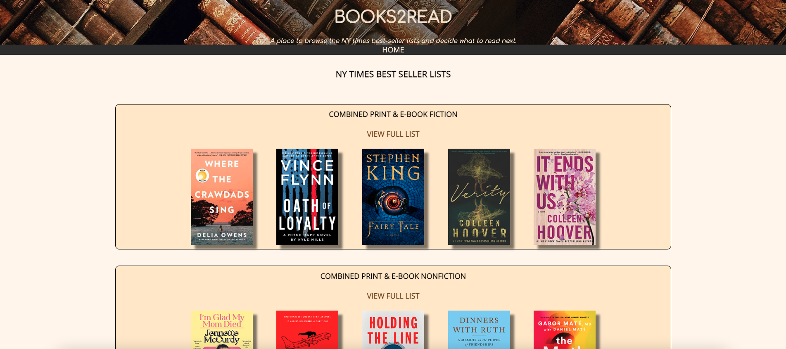
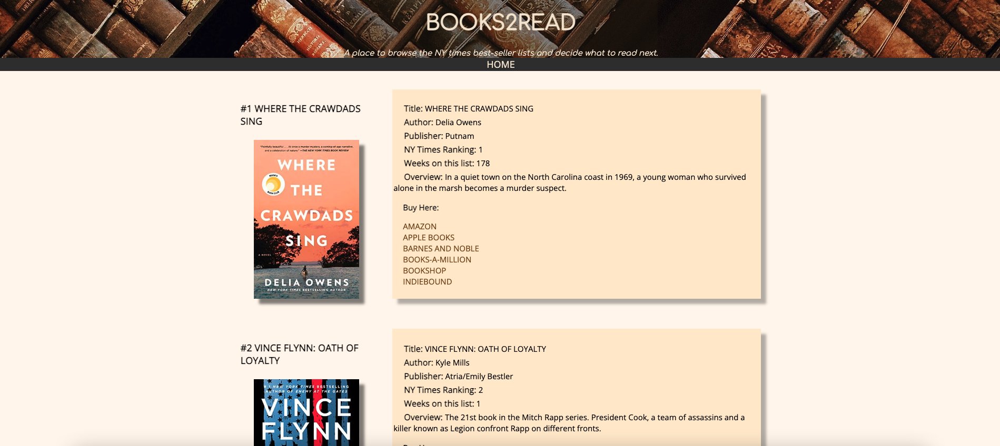
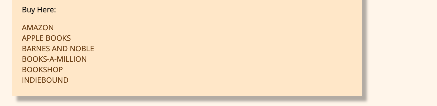

# Books2Read

An app to browse the NY times best-seller lists and decide what to read next.

## App Description
Books2Read is an application for a user who is looking to review the NYTimes best seller list to help decide which book they would like to read next. Users can see a list of all of the books on the best seller list for a given period. They also have the ability to click on a book and see additional details about that book. Users can view this site on a mobile device as it was responsively designed

## Planning
### Wire Frame

## Functionality
### Screenshots

 - User is able to browse all current NY Times Bestseller Lists
 - User can click on any list and will be taken to the respective NY Times List page
 - This page includes a frozen header for easy navigation

- User can browse the results of the NY Times List (ie: Hardcover Best-Sellers, Paperback Fiction, etc.)
- Users can read information about the books including title, author, summary, and where to buy

- Users can click on these links and be redirected to the retailer website to purchase a book

## Technologies Used
- React JS
- CSS (Flexbox & Media Queries for a responsive mobile-friendly design)
- NY Times Books API
## Getting Started
### Link to App
https://books2read1.netlify.app/

To get started, click on the link above. Once on the page, scroll through to see which list you are interested in viewing. Select the "view full list" hyperlink to see more results of that desired list. Scroll through to read about the books on your list of choice! If really interested, click on the provided links to various retailers to purchase your book of choice!

### Future Goals
- Expand to include reviews for books
- Include search functionality

